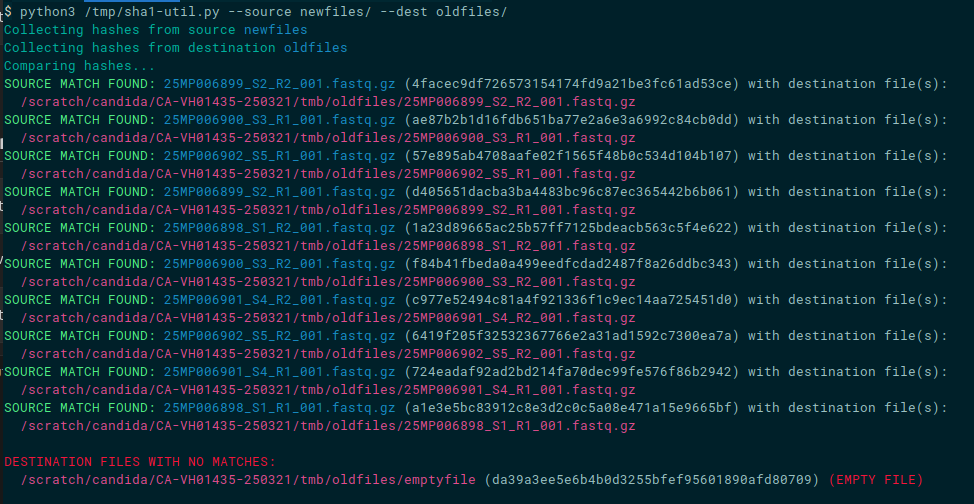

# sha1-util.py - SHA1SUM file Comparison Tool

This script compares the SHA1 checksums of files between two directories to identify matching and non-matching files. It is useful for verifying the integrity of files, or verifying checksums when filenames have changed. A Dockerfile is included for environments running the script in a docker container is a more favorable option.

## Features
- Calculates SHA1 hashes of files in the specified directories.
- Compares the hashes to find matching and non-matching files.
- Supports command-line arguments for specifying source and destination directories.
- Uses color-coded output for better readability.

## Requirements
- Python 3.x
- `hashlib` library (included in Python standard library)
- `argparse` library (included in Python standard library)

## Installation
No additional installation is required. Ensure you have Python 3.x installed on your system.

## Usage
```sh
python sha1_compare.py -s <source_directory> -d <destination_directory>
```
- `-s`, `--source_dir`: Source directory to compare (default is the current directory).
- `-d`, `--dest_dir`: Destination directory to compare against (required).

## Example
```sh
python3 sha1-util.py -s /path/to/source -d /path/to/destination
```
relative paths from the current directory are also acceptable as arguments:
```sh
python3 sha1-util.py -s ./ -d ../../destdir
```

### Running with Docker

You can also run the script using Docker and the included Dockerfile. First, build the Docker image:

```sh
docker build -t tmp-docker .
```

Then, run the Docker container with the appropriate volume mappings:

```sh
docker run --rm --volume /scratch:/scratch tmp-docker --source /scratch/source --dest /scratch/dest
```

## Output
- The script will output matching and non-matching files with color-coded indicators:
  - Green: Matching files
  - Red: Non-matching files
  - Blue: Source file names
  - Magenta: Destination files/paths
  - Cyan: Informational messages
  - 

## Notes
- The script handles empty files and indicates them in the output with the word "(EMPTY)" in red.
- The script currently scans one directory level deep when looking for files.

## License
This script is licensed under the GNU GPLv3 license. See the LICENSE file for details.

## Author
tmb
```
